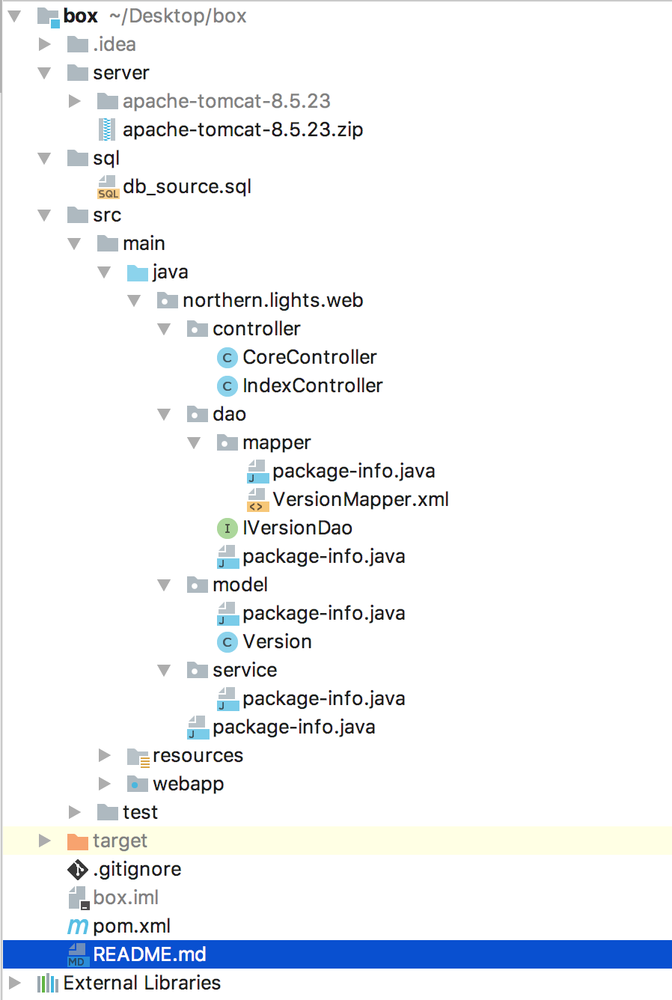

#box

#### 示例:

* 运行效果

* 项目结构

### 特性

* 简单，5分钟入手
* 功能强大，已经整合丰富第三方类库
* 集成简单，可以方便的集成第三方类库

### 原理说明

项目本身只是做了部分编码规范和调整，使用类库包含`Spring`，`SpringMVC`，`MyBatis`，`c3p0`，`swagger2`，`fastjson`等常用框架，并没有涉及到第三方框架开发

### 开发推荐

* IDEA
* MySQL5.7
* Maven3

### License

遵守的协议`GPL3`